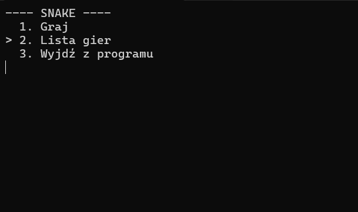
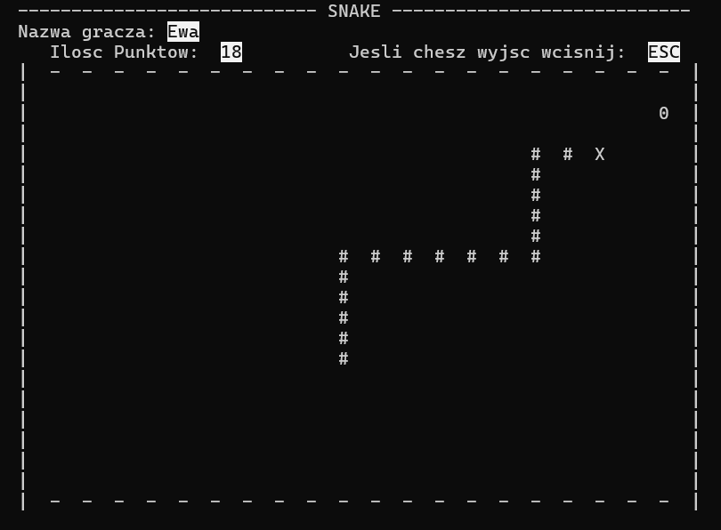

# 🐍 SNAKE

Classic console Snake recreated in modern C++. Move through the grid, collect apples, and compete for the top score in this fully interactive terminal experience built as a university project.

## Table of contents
- [Features](#features)
- [Gameplay](#gameplay)
- [Controls](#controls)
- [Quick start](#quick-start)
- [Project structure](#project-structure)
- [Screenshots](#screenshots)
- [Future ideas](#future-ideas)

## Features
- Colourful Windows console UI with an animated main menu and in-game HUD.
- Persistent high-score table saved between sessions (`wyniki_gier.txt`).
- Adjustable game difficulty and board size through the menu system.
- Clean separation of responsibilities across menu, board, and snake logic.

## Gameplay
Your goal is to guide the snake to collect apples without hitting the walls or your own tail. Every apple increases your score and adds one segment to the snake, making each run increasingly challenging.

## Controls
| Action | Key |
| ------ | --- |
| Move up | `W` |
| Move down | `S` |
| Move left | `A` |
| Move right | `D` |
| Pause | `P` |

## Quick start
### Prerequisites
- Windows 10/11
- [Visual Studio 2022](https://visualstudio.microsoft.com/vs/) with the **Desktop development with C++** workload

### Build & run
1. Clone this repository:
   ```bash
   git clone https://github.com/<your-username>/SNAKE.git
   ```
2. Open `SNAKE/SNAKE.sln` in Visual Studio.
3. Select the `x64` configuration (Debug or Release).
4. Press <kbd>F5</kbd> to build and launch the game.

> ℹ️ The project uses standard Visual Studio settings, so no additional configuration is required after opening the solution.

### Command-line build (optional)
If you prefer working from the terminal, you can use the Visual Studio Developer Command Prompt:
```cmd
msbuild SNAKE\SNAKE.vcxproj /p:Configuration=Release /p:Platform=x64
```
The compiled executable will be located in `SNAKE/x64/Release/`.

## Project structure
```
SNAKE/
├── Menu.cpp / Menu.h         # Menu screens and user interaction
├── Plansza.cpp / Plansza.h   # Game board rendering and logic
├── Waz.h                     # Snake data structure and movement routines
├── Polozenie.h               # Position helpers shared across components
├── Obiekt.h                  # Base class for drawable objects
├── main.cpp                  # Entry point and game loop orchestration
├── wyniki_gier.txt           # Persistent high-score table
└── Photos/                   # Screenshot assets used in this README
```

## Screenshots
<p align="center">
  
  
</p>

<p align="center">
  
  
</p>

## Future ideas
- Add sound effects for collisions and menu navigation.
- Introduce special power-up items with temporary effects.
- Port the rendering layer to an immediate-mode GUI library for a richer UI.

Enjoy the game and feel free to fork the project to build your own twist on the Snake classic!
